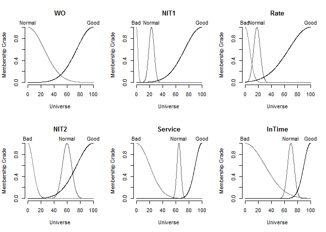
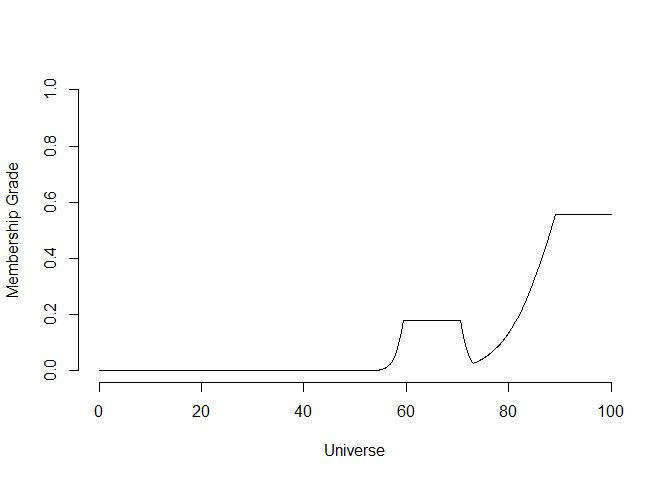
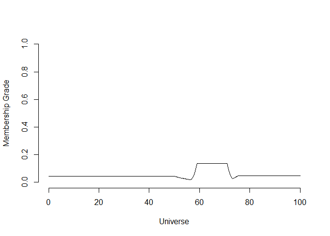
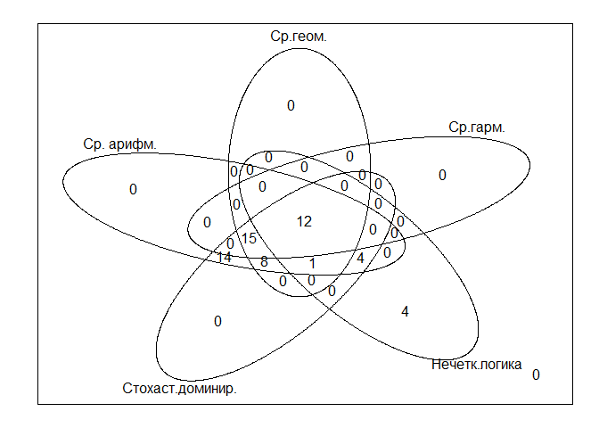
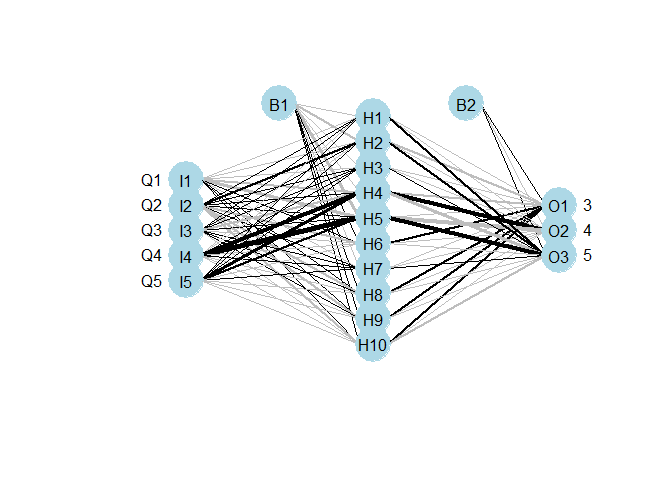

# Квалиметрические модели и методы в сфере услуг
Тушавин В. А.  
Sunday, November 23, 2014  

Целью данной статьи является сравнение основных квалиметрических моделей и методов применительно к задаче оценки комплексного показателя качества услуг.

В расчетах используются следующие [данные](article1.md) из статьи *Тушавин В. А. Робастный подход к оценке комплексного показателя качества ИТ-услуг // [Системы управления и информационные технологии](http://www.sbook.ru/suit/suit.htm). 2014. № 4 (58). С. 92–95.*:


1. Таблица шкалированных показателей качества (td)
2. Целевые значения показателей качества (minimum,target)
3. Матрица рандомизированных коэффицентов (mtx)


```r
td<-readRDS("table1.RDS")
minimum<-readRDS("minimum.RDS")
target<-readRDS("target.RDS")
mtx<-readRDS("mtx.RDS")
```

### Комплексный показатель качества как взвешенное среднее по Колмогорову

В качестве весов используем матожидание случайных коэффициентов


```r
(coeff<-apply(mtx,2,mean))
```

```
## [1] 0.15659391 0.25911424 0.04948085 0.07812063 0.45669038
```

```r
rm(mtx)
```

#### Cреднее арифметическое взвешенное


```r
td$M1<-apply(td[,2:6],1,FUN=function(x){weighted.mean(x,coeff)})
test.t<-weighted.mean(target,coeff)
test.m<-weighted.mean(minimum,coeff)
(X1.t<-sum(td$M1>=test.t))
```

```
## [1] 54
```

```r
(X1.m<-sum(td$M1>=test.m))
```

```
## [1] 58
```

```r
X1.a<-td$M1>=test.t
```

#### Cреднее геометрическое взвешенное

```r
td$M2<-apply(td[,2:6],1,FUN=function(x){exp(weighted.mean(log(x),coeff))})
test.t<-exp(weighted.mean(log(target),coeff))
test.m<-exp(weighted.mean(log(minimum),coeff))
(X2.t<-sum(td$M2>=test.t))
```

```
## [1] 36
```

```r
(X2.m<-sum(td$M2>=test.m))
```

```
## [1] 58
```

```r
X2.a<-td$M2>=test.t
```

#### Cреднее гармоническое взвешенное

```r
td$M3<-apply(td[,2:6],1,FUN=function(x){1/sum(coeff/x)})
test.t<-1/sum(coeff/target)
test.m<-1/sum(coeff/minimum)
(X3.t<-sum(td$M3>=test.t))
```

```
## [1] 27
```

```r
(X3.m<-sum(td$M3>=test.m))
```

```
## [1] 58
```

```r
X3.a<-td$M3>=test.t
```

### Оценка комплексного показателя качества c помощью нечеткой логики


Настроим систему:


```r
library(sets)
sets_options("universe", seq(from = 0, to = 100, by = 0.1))
variables <-set(
    InTime=
     fuzzy_variable(Bad=fuzzy_normal(mean=0,sd=30),
                    Normal=fuzzy_normal(mean=70,sd=5),
                    Good=fuzzy_normal(mean=100,sd=10)),
    WO =
           fuzzy_variable(Normal=fuzzy_normal(mean=0,sd=25),
                    Good=fuzzy_normal(mean=100,sd=25)),
    NIT1 =
            fuzzy_variable(Bad = fuzzy_normal(mean=0,sd=2),
                      Normal = fuzzy_normal(mean=23,sd=4),
                      Good = fuzzy_normal(mean=100,sd=26)),
    NIT2 =
            fuzzy_variable(Bad = fuzzy_normal(mean=0,sd=8),
                      Normal = fuzzy_normal(mean=60,sd=7),
                      Good = fuzzy_normal(mean=100,sd=25)),

    Rate =
           fuzzy_variable(Bad=fuzzy_normal(mean=0,sd=7),
          Normal=fuzzy_normal(mean=18,sd=5),
          Good=fuzzy_normal(mean=100,sd=33)),
    Service = fuzzy_variable(
          Bad=fuzzy_normal(mean=0,sd=20),
          Normal= fuzzy_normal(mean=65,sd=3),
          Good=fuzzy_normal(mean=100,sd=10))

    )
 rules <-
set(
    fuzzy_rule(
        NIT1 %is% Bad, Service %is% Bad),
    fuzzy_rule(
        NIT1 %is% Normal, Service %is% Normal),
    fuzzy_rule(
        NIT1 %is% Good, Service %is% Good),
    fuzzy_rule(
        NIT2 %is% Bad, Service %is% Bad),
    fuzzy_rule(
        NIT2 %is% Normal, Service %is% Normal),
    fuzzy_rule(
        NIT2 %is% Good, Service %is% Good),
    fuzzy_rule(
        InTime %is% Good && Rate  %is% Bad  && WO %is% Normal, Service %is% Bad), 
    fuzzy_rule(
        InTime %is% Good && Rate  %is% Bad  && WO %is% Good, Service %is% Bad), 
    fuzzy_rule(
        InTime %is% Good && Rate %is% Good && WO %is% Normal, Service %is% Good),
    fuzzy_rule(
        InTime %is% Good && Rate %is% Good && WO %is% Good, Service %is% Good),
    fuzzy_rule(
        InTime %is% Good && Rate %is% Normal && WO %is% Normal, Service %is% Normal),
    fuzzy_rule(
        InTime %is% Good && Rate %is% Normal && WO %is% Good, Service %is% Good),
    fuzzy_rule(
        InTime %is% Normal && Rate  %is% Bad && WO %is% Normal, Service %is% Bad),
    fuzzy_rule(
        InTime %is% Normal && Rate  %is% Bad && WO %is% Good, Service %is% Bad),
    fuzzy_rule(
        InTime %is% Normal && Rate %is% Good && WO %is% Normal, Service %is% Normal),
    fuzzy_rule(
        InTime %is% Normal && Rate %is% Good && WO %is% Good, Service %is% Good),
    fuzzy_rule(
        InTime %is% Normal && Rate %is% Normal && WO %is% Normal, Service %is% Normal),
    fuzzy_rule(
        InTime %is% Normal && Rate %is% Normal && WO %is% Good, Service %is% Normal),
    fuzzy_rule(
        InTime %is% Bad && Rate  %is% Bad && WO %is% Normal, Service %is% Bad), 
    fuzzy_rule(
        InTime %is% Bad && Rate  %is% Bad && WO %is% Good, Service %is% Bad), 
    fuzzy_rule(
        InTime %is% Bad && Rate %is% Good && WO %is% Normal, Service %is% Normal),
    fuzzy_rule(
        InTime %is% Bad && Rate %is% Good && WO %is% Good, Service %is% Good),
    fuzzy_rule(
        InTime %is% Bad && Rate %is% Normal && WO %is% Normal, Service %is% Bad),
    fuzzy_rule(
        InTime %is% Bad && Rate %is% Normal && WO %is% Good, Service %is% Bad)
    )   
system <- fuzzy_system(variables, rules)
print(system)
```

```
## A fuzzy system consisting of 6 variables and 24 rules.
## 
## Variables:
## 
## WO(Normal, Good)
## NIT1(Bad, Normal, Good)
## Rate(Bad, Normal, Good)
## NIT2(Bad, Normal, Good)
## Service(Bad, Normal, Good)
## InTime(Bad, Normal, Good)
## 
## Rules:
## 
## InTime %is% Bad && Rate %is% Good && WO %is% Normal => Service %is% Normal
## InTime %is% Bad && Rate %is% Good && WO %is% Good => Service %is% Good
## InTime %is% Bad && Rate %is% Normal && WO %is% Good => Service %is% Bad
## InTime %is% Bad && Rate %is% Normal && WO %is% Normal => Service %is% Bad
## InTime %is% Bad && Rate %is% Bad && WO %is% Good => Service %is% Bad
## InTime %is% Bad && Rate %is% Bad && WO %is% Normal => Service %is% Bad
## InTime %is% Good && Rate %is% Bad && WO %is% Normal => Service %is% Bad
## InTime %is% Good && Rate %is% Bad && WO %is% Good => Service %is% Bad
## InTime %is% Good && Rate %is% Normal && WO %is% Good => Service %is% Good
## InTime %is% Good && Rate %is% Normal && WO %is% Normal => Service %is% Normal
## InTime %is% Good && Rate %is% Good && WO %is% Normal => Service %is% Good
## InTime %is% Good && Rate %is% Good && WO %is% Good => Service %is% Good
## InTime %is% Normal && Rate %is% Bad && WO %is% Good => Service %is% Bad
## InTime %is% Normal && Rate %is% Bad && WO %is% Normal => Service %is% Bad
## InTime %is% Normal && Rate %is% Good && WO %is% Normal => Service %is% Normal
## InTime %is% Normal && Rate %is% Good && WO %is% Good => Service %is% Good
## InTime %is% Normal && Rate %is% Normal && WO %is% Good => Service %is% Normal
## InTime %is% Normal && Rate %is% Normal && WO %is% Normal => Service %is% Normal
## NIT1 %is% Bad => Service %is% Bad
## NIT1 %is% Good => Service %is% Good
## NIT1 %is% Normal => Service %is% Normal
## NIT2 %is% Bad => Service %is% Bad
## NIT2 %is% Good => Service %is% Good
## NIT2 %is% Normal => Service %is% Normal
```

```r
plot(system) 
```

 

Функция, проводящая дефаззификацию


```r
fuzzy.calc<-function(system,x,draw=FALSE) {
  x<-round(as.vector(x,"double"),0)
  names(x)<-c("InTime","WO","NIT1","NIT2","Rate") 
  fi <- fuzzy_inference(system, x)
if(draw) plot(fi)
return(gset_defuzzify(fi, "centroid"))
}
```
Рачеты для минимимально допустимого и целевого показателя


```r
(test.t<-fuzzy.calc(system,target*100,TRUE))
```

 

```
## [1] 85.22826
```

```r
(test.m<-fuzzy.calc(system,minimum*100,TRUE))
```

 

```
## [1] 53.9323
```

Расчеты для всех показателей в таблице


```r
td$F1<-apply(td[,2:6],1,FUN=function(x){fuzzy.calc(system,x*100)})
sets_options("universe", NULL)
(X4.t<-sum(td$F1>=test.t))
```

```
## [1] 21
```

```r
(X4.m<-sum(td$F1>=test.m))
```

```
## [1] 58
```

```r
X4.a<-td$F1>=test.t
X5.a<-td$target>=0.6
head(td)
```

```
##           YM        Q1        Q2        Q3        Q4        Q5 minimum
## 1 2010-01-01 0.9155796 0.9842703 0.9553734 0.6296348 0.3710837       1
## 2 2010-02-01 0.8835840 0.7035583 0.9010373 0.7462359 0.3248447       1
## 3 2010-03-01 0.9221653 0.3843156 0.8768185 0.8236437 0.3037147       1
## 4 2010-04-01 0.9893444 0.7336108 0.8591666 0.8379938 0.2560335       1
## 5 2010-05-01 0.9884817 0.9716582 0.8846832 0.8176888 0.3435733       1
## 6 2010-06-01 0.9872346 0.9794158 0.8708995 0.6474403 0.2999945       1
##   target        M1        M2        M3       F1
## 1  1.000 0.6643431 0.6010675 0.5432283 82.00496
## 2  0.245 0.5718998 0.5209940 0.4737111 85.97245
## 3  0.001 0.4904200 0.4376388 0.4001608 87.86125
## 4  0.302 0.5699192 0.4840922 0.4088285 90.18262
## 5  1.000 0.6711205 0.5951406 0.5247149 90.49045
## 6  0.966 0.6390514 0.5498810 0.4710350 81.55100
```


```r
library(limma)
c3 <- cbind(X1.a, X2.a, X3.a,X4.a,X5.a)
a <- vennCounts(c3)
vennDiagram(a, names = c("Ср. арифм.", "Ср.геом.", "Ср.гарм.","Нечетк.логика","Стохаст.доминир."),cex = 1)
```

 

### Прогнозирование комплексного показателя качества c помощью предиктивных моделей

Подразумевается, что оценку комплексного показателя качества должны производить эксперты, после чего построив модель на обучающей выборке и выбрав потом наилучший метод с помощью верифицирующих данных модель должна быть проверена на тестовых данных.

В данном случае мы используем оценку произведенную нечеткой логикой в качестве экспертной и пытаемся сравнить различные методы. Расчеты предназначены для демонстрации подходов, поскольку размер выборки слишком мал как для полноценного обучения, так и для верификации модели.

Исследования о применимости различных моделей в практической деятельности опубликованы в статьях:

*Тушавин В. А. Анализ качества ИТ-услуг с использованием классификационных деревьев // Экономика и менеджмент систем управления. 2013. № 4.1 (10). С. 211–217.*

*Тушавин В. А. Моделирование показателей качества технической поддержки с использованием Random forest // Научная сессия ГУАП: Сб .докл.: В 3 ч. Ч. I. Технические науки. СПб.: ГУАП, 2013. С. 215–216.*


```r
set.seed(2014)
study<-sample(1:nrow(td),nrow(td)/4*3)
td$F2<-as.factor(round(td$F1/20,0)-ifelse(td$target<0.6,1,0))
td.learn<-td[study,c(1:6,13)]
td.test<-td[-study,c(1:6,13)]
library(caret)
```

```
## Loading required package: lattice
## Loading required package: ggplot2
```

#### Нейронная сеть (single-hidden-layer neural network)


```r
library(nnet)
mod1<-nnet(F2~Q1+Q2+Q3+Q4+Q5,data=td.learn,size=10,rang=0.1,decay = 5e-4,maxit=500)
```

```
## # weights:  93
## initial  value 51.571966 
## iter  10 value 18.141608
## iter  20 value 13.336835
## iter  30 value 9.137534
## iter  40 value 3.330220
## iter  50 value 2.021194
## iter  60 value 1.530542
## iter  70 value 1.394292
## iter  80 value 1.295381
## iter  90 value 1.256059
## iter 100 value 1.242192
## iter 110 value 1.221921
## iter 120 value 1.207674
## iter 130 value 1.200788
## iter 140 value 1.186452
## iter 150 value 1.160913
## iter 160 value 1.146677
## iter 170 value 1.138477
## iter 180 value 1.131848
## iter 190 value 1.128649
## iter 200 value 1.121426
## iter 210 value 1.114173
## iter 220 value 1.109080
## iter 230 value 1.104802
## iter 240 value 1.100922
## iter 250 value 1.098824
## iter 260 value 1.094861
## iter 270 value 1.093082
## iter 280 value 1.091517
## iter 290 value 1.090298
## iter 300 value 1.089708
## iter 310 value 1.088488
## iter 320 value 1.086748
## iter 330 value 1.081262
## iter 340 value 1.077201
## iter 350 value 1.075689
## iter 360 value 1.074857
## iter 370 value 1.074511
## iter 380 value 1.073996
## iter 390 value 1.073820
## iter 400 value 1.073678
## iter 410 value 1.073552
## iter 420 value 1.073231
## iter 430 value 1.072945
## iter 440 value 1.072563
## iter 450 value 1.072097
## iter 460 value 1.071600
## iter 470 value 1.071263
## iter 480 value 1.070947
## iter 490 value 1.070760
## iter 500 value 1.070659
## final  value 1.070659 
## stopped after 500 iterations
```

```r
confusionMatrix(td.test$F2, factor(predict(mod1, td.test[,2:6], type = "class"),levels=c("3","4","5")))
```

```
## Confusion Matrix and Statistics
## 
##           Reference
## Prediction  3  4  5
##          3  0  1  0
##          4  0 11  1
##          5  0  0  2
## 
## Overall Statistics
##                                           
##                Accuracy : 0.8667          
##                  95% CI : (0.5954, 0.9834)
##     No Information Rate : 0.8             
##     P-Value [Acc > NIR] : 0.398           
##                                           
##                   Kappa : 0.6             
##  Mcnemar's Test P-Value : NA              
## 
## Statistics by Class:
## 
##                      Class: 3 Class: 4 Class: 5
## Sensitivity                NA   0.9167   0.6667
## Specificity           0.93333   0.6667   1.0000
## Pos Pred Value             NA   0.9167   1.0000
## Neg Pred Value             NA   0.6667   0.9231
## Prevalence            0.00000   0.8000   0.2000
## Detection Rate        0.00000   0.7333   0.1333
## Detection Prevalence  0.06667   0.8000   0.1333
## Balanced Accuracy          NA   0.7917   0.8333
```

Схема нейронной сети (см. статью [Visualizing neural networks in R – update](https://beckmw.wordpress.com/2013/11/14/visualizing-neural-networks-in-r-update/))


```r
library(devtools)
```

```
## WARNING: Rtools is required to build R packages, but is not currently installed.
## 
## Please download and install Rtools 3.1 from http://cran.r-project.org/bin/windows/Rtools/ and then run find_rtools().
## 
## Attaching package: 'devtools'
## 
## The following object is masked _by_ '.GlobalEnv':
## 
##     test
```

```r
source_url('https://gist.githubusercontent.com/fawda123/7471137/raw/466c1474d0a505ff044412703516c34f1a4684a5/nnet_plot_update.r')
```

```
## SHA-1 hash of file is 74c80bd5ddbc17ab3ae5ece9c0ed9beb612e87ef
```

```r
plot.nnet(mod1)
```

```
## Loading required package: scales
## Loading required package: reshape
```

 


#### Метод опорных векторов

```r
library(e1071)
mod2<-svm(F2~Q1+Q2+Q3+Q4+Q5,data=td.learn,gamma=0.1)
confusionMatrix(td.test$F2, factor(predict(mod2, td.test[,2:6]),levels=c("3","4","5")))
```

```
## Confusion Matrix and Statistics
## 
##           Reference
## Prediction  3  4  5
##          3  0  1  0
##          4  0 12  0
##          5  0  2  0
## 
## Overall Statistics
##                                           
##                Accuracy : 0.8             
##                  95% CI : (0.5191, 0.9567)
##     No Information Rate : 1               
##     P-Value [Acc > NIR] : 1               
##                                           
##                   Kappa : 0               
##  Mcnemar's Test P-Value : NA              
## 
## Statistics by Class:
## 
##                      Class: 3 Class: 4 Class: 5
## Sensitivity                NA      0.8       NA
## Specificity           0.93333       NA   0.8667
## Pos Pred Value             NA       NA       NA
## Neg Pred Value             NA       NA       NA
## Prevalence            0.00000      1.0   0.0000
## Detection Rate        0.00000      0.8   0.0000
## Detection Prevalence  0.06667      0.8   0.1333
## Balanced Accuracy          NA       NA       NA
```

#### Случайный лес

```r
require(randomForest)
```

```
## Loading required package: randomForest
## randomForest 4.6-10
## Type rfNews() to see new features/changes/bug fixes.
```

```r
mod3<-randomForest(F2~Q1+Q2+Q3+Q4+Q5,data=td.learn,type="classification",ntree=500)
confusionMatrix(td.test$F2, factor(predict(mod2, td.test[,2:6]),levels=c("3","4","5")))
```

```
## Confusion Matrix and Statistics
## 
##           Reference
## Prediction  3  4  5
##          3  0  1  0
##          4  0 12  0
##          5  0  2  0
## 
## Overall Statistics
##                                           
##                Accuracy : 0.8             
##                  95% CI : (0.5191, 0.9567)
##     No Information Rate : 1               
##     P-Value [Acc > NIR] : 1               
##                                           
##                   Kappa : 0               
##  Mcnemar's Test P-Value : NA              
## 
## Statistics by Class:
## 
##                      Class: 3 Class: 4 Class: 5
## Sensitivity                NA      0.8       NA
## Specificity           0.93333       NA   0.8667
## Pos Pred Value             NA       NA       NA
## Neg Pred Value             NA       NA       NA
## Prevalence            0.00000      1.0   0.0000
## Detection Rate        0.00000      0.8   0.0000
## Detection Prevalence  0.06667      0.8   0.1333
## Balanced Accuracy          NA       NA       NA
```

Информация о параметрах R


```r
sessionInfo()
```

```
## R version 3.1.2 (2014-10-31)
## Platform: x86_64-w64-mingw32/x64 (64-bit)
## 
## locale:
## [1] LC_COLLATE=Russian_Russia.1251  LC_CTYPE=Russian_Russia.1251   
## [3] LC_MONETARY=Russian_Russia.1251 LC_NUMERIC=C                   
## [5] LC_TIME=Russian_Russia.1251    
## 
## attached base packages:
## [1] stats     graphics  grDevices utils     datasets  methods   base     
## 
## other attached packages:
##  [1] randomForest_4.6-10 e1071_1.6-4         reshape_0.8.5      
##  [4] scales_0.2.4        devtools_1.6.1      nnet_7.3-8         
##  [7] caret_6.0-35        ggplot2_1.0.0       lattice_0.20-29    
## [10] limma_3.22.1        sets_1.0-13        
## 
## loaded via a namespace (and not attached):
##  [1] BradleyTerry2_1.0-5 brglm_0.5-9         car_2.0-21         
##  [4] class_7.3-11        codetools_0.2-9     colorspace_1.2-4   
##  [7] digest_0.6.4        evaluate_0.5.5      foreach_1.4.2      
## [10] formatR_1.0         grid_3.1.2          gtable_0.1.2       
## [13] gtools_3.4.1        htmltools_0.2.6     httr_0.5           
## [16] iterators_1.0.7     knitr_1.7           lme4_1.1-7         
## [19] MASS_7.3-35         Matrix_1.1-4        minqa_1.2.4        
## [22] munsell_0.4.2       nlme_3.1-118        nloptr_1.0.4       
## [25] plyr_1.8.1          proto_0.3-10        Rcpp_0.11.3        
## [28] RCurl_1.95-4.3      reshape2_1.4        rmarkdown_0.3.3    
## [31] splines_3.1.2       stringr_0.6.2       tools_3.1.2        
## [34] yaml_2.1.13
```
