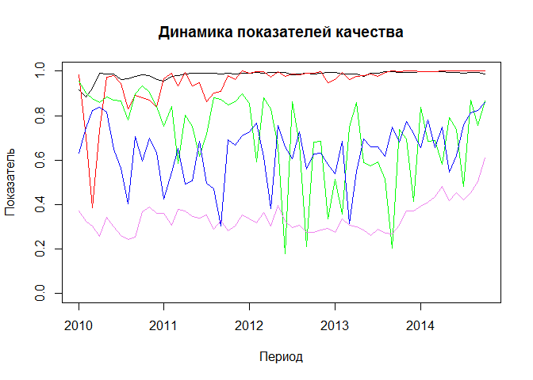
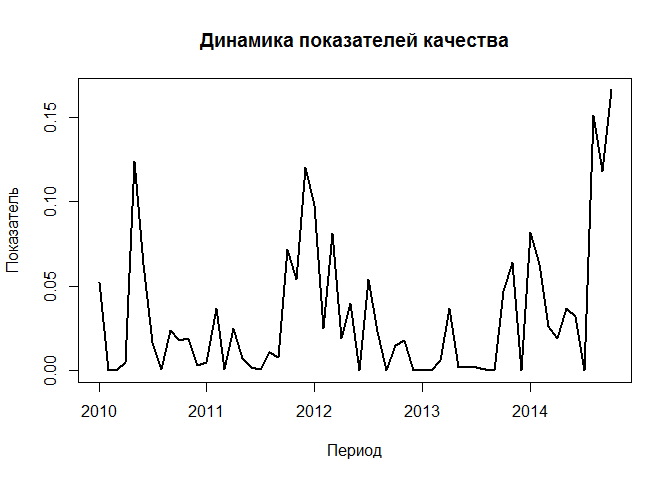
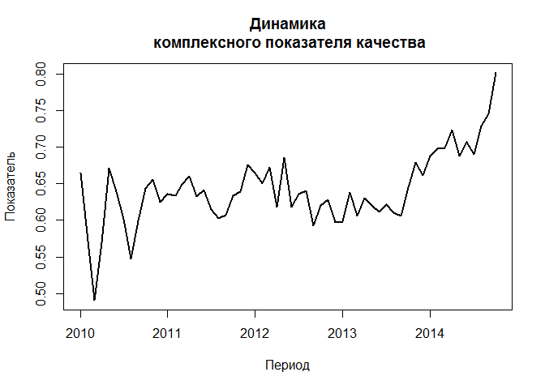

# Робастный подход к оценке комплексного показателя качества ИТ-услуг
Тушавин В. А.  
Friday, November 14, 2014  

Целью настоящей статьи является описание подхода к решению задачи оценки комплексного показателя качества с помощью методов стохастического доминирования применительно к оценке качества оказываемых ИТ-услуг. В качестве входных параметров для оценки комплексного показателя качества по предложенной методике использованы данные службы технической поддержки с января 2010 года по октябрь 2014 года (всего 58 измерений). Таблица включает в себя следующие колонки: год (Year), месяц (Month), общее число зарегистрированных обращений (Total), число обращений, выполненных с нарушением срока (Bad), среднее время в секундах от регистрации обращения до приема в работу (Reg time), среднее время работы над обращением в секундах (Work Time), число жалоб (Claim), средняя оценка (Rate). 

### Загрузка данных

```r
mydata<-readRDS("datafile.RDS")
dim(mydata)
```

```
## [1] 58  8
```

```r
head(mydata)
```

```
##   Year Month Total Bad Reg_time Work_Time Claim     Rate
## 1 2010     1  2392 139     1521     35054     3 3.413915
## 2 2010     2  2755 188     2265     29016    15 3.356643
## 3 2010     3  3441 192     2527     24189    27 3.331126
## 4 2010     4  3100  64     2702     23184    16 3.274930
## 5 2010     5  2376  51     2445     24594     4 3.379597
## 6 2010     6  2788  63     2587     34201     4 3.326673
```

```r
summary(mydata)
```

```
##       Year          Month            Total           Bad        
##  Min.   :2010   Min.   : 1.000   Min.   :2376   Min.   : 27.00  
##  1st Qu.:2011   1st Qu.: 3.250   1st Qu.:3367   1st Qu.: 55.50  
##  Median :2012   Median : 6.000   Median :3569   Median : 70.50  
##  Mean   :2012   Mean   : 6.328   Mean   :3632   Mean   : 77.43  
##  3rd Qu.:2013   3rd Qu.: 9.000   3rd Qu.:4002   3rd Qu.: 89.00  
##  Max.   :2014   Max.   :12.000   Max.   :5407   Max.   :192.00  
##     Reg_time      Work_Time         Claim             Rate      
##  Min.   :1521   Min.   :21509   Min.   : 0.000   Min.   :3.261  
##  1st Qu.:2650   1st Qu.:30053   1st Qu.: 1.000   1st Qu.:3.317  
##  Median :3569   Median :33680   Median : 4.000   Median :3.359  
##  Mean   :3639   Mean   :33889   Mean   : 5.431   Mean   :3.379  
##  3rd Qu.:4556   3rd Qu.:37829   3rd Qu.: 8.000   3rd Qu.:3.414  
##  Max.   :6526   Max.   :48028   Max.   :27.000   Max.   :3.749
```

### Функции, которые будут использоваться для анализа

Преобразование шкал с учетом потери качества

```r
convert.scale<-function(bad,good,val) {
  x1=bad
  x2=good
  x3=2*good-bad
  y1=0
  y2=1
  y3=0
  a<-(y3-(x3*(y2-y1)+x2*y1-x1*y2)/(x2-x1))/(x3*(x3-x1-x2)+x1*x2)
  b<-(y2-y1)/(x2-x1)-a*(x1+x2)
  c<-(x2*y1-x1*y2)/(x2-x1)+a*x1*x2
  y=a*val*val+b*val+c
  return(ifelse(y>0,y,0))
}
```
Генерация матрицы случайных чисел с заданными ограничениями, равномерно распределенными на ограниченном симплексе с использованием распределение Дирихле
$$  \mathbb{\dot{S}}^m=\{(p_1 \ldots p_m): \sum^m_{i=1}p_i=1;p_i \geqslant 0, i=1, \ldots m; p_a \geqslant p_b, \ldots, p_c \geqslant p_d\} $$


```r
set.seed(2014)
library(gtools)
rpoly<-function(n=1, size=2,test=data.frame()) {
  mtx<-rdirichlet(n,rep(1,size))
  if(length(test)==0) return(mtx) 
  for(j in 1:n) {
    while(TRUE) {
     flag=TRUE
      for(i in 1:nrow(test)) {
      if(mtx[j,test$master[i]]<mtx[j,test$slave[i]]) {
        tmp<-mtx[j,test$slave[i]]
        mtx[j,test$slave[i]]<-mtx[j,test$master[i]]
        mtx[j,test$master[i]]<-tmp
        flag=FALSE
      }
    
      }
   if(flag) break
  }
}
return(mtx)
}
```
### Преобразование данных

Создаем новую таблицу для анализа


```r
td<-data.frame(YM=as.Date(paste(mydata$Year,mydata$Month,"1",sep="-")))
```
Первый показатель качества $Q_1$, находим как долю обращений выполненных вовремя. Идеальный показатель 1, минимально допустимый 0.8


```r
td$Q1<-convert.scale(0.8,1,1-mydata$Bad/mydata$Total)
```

Второй показатель качества $Q_2$ находим как долю обращений без жалоб к общему числу обращений.
Идеальный показатель 1, минимально допустимый 0.99


```r
td$Q2<-convert.scale(0.99,1,1-mydata$Claim/mydata$Total)
```

Третий показатель качества $Q_3$ считаем как отклонение от максимально допустимого времени 7200 секунд (2 часа).  Идеальный показатель 7200, минимально допустимый 0.


```r
td$Q3<-convert.scale(0,7200,7200-mydata$Reg_time)
```
Четвертый показатель качества $Q_4$ считаем как отклонение от максимально допустимого времени в два дня 57600 секунд (16 часов).  Идеальный показатель 57600, минимально допустимый 0.


```r
td$Q4<-convert.scale(0,57600,57600-mydata$Work_Time)
```
Пятый показатель качества $Q_5$ --- средняя оценка. Идеальный 5, минимально допустимый 3.


```r
td$Q5<-convert.scale(3,5,mydata$Rate)
```
Результаты обработки данных


```r
head(td)
```

```
##           YM        Q1        Q2        Q3        Q4        Q5
## 1 2010-01-01 0.9155796 0.9842703 0.9553734 0.6296348 0.3710837
## 2 2010-02-01 0.8835840 0.7035583 0.9010373 0.7462359 0.3248447
## 3 2010-03-01 0.9221653 0.3843156 0.8768185 0.8236437 0.3037147
## 4 2010-04-01 0.9893444 0.7336108 0.8591666 0.8379938 0.2560335
## 5 2010-05-01 0.9884817 0.9716582 0.8846832 0.8176888 0.3435733
## 6 2010-06-01 0.9872346 0.9794158 0.8708995 0.6474403 0.2999945
```

```r
summary(td)
```

```
##        YM                   Q1               Q2               Q3        
##  Min.   :2010-01-01   Min.   :0.8836   Min.   :0.3843   Min.   :0.1785  
##  1st Qu.:2011-03-08   1st Qu.:0.9862   1st Qu.:0.9488   1st Qu.:0.5996  
##  Median :2012-05-16   Median :0.9903   Median :0.9834   Median :0.7543  
##  Mean   :2012-05-16   Mean   :0.9842   Mean   :0.9495   Mean   :0.7165  
##  3rd Qu.:2013-07-24   3rd Qu.:0.9941   3rd Qu.:0.9992   3rd Qu.:0.8645  
##  Max.   :2014-10-01   Max.   :0.9985   Max.   :1.0000   Max.   :0.9554  
##        Q4               Q5        
##  Min.   :0.3047   Min.   :0.2437  
##  1st Qu.:0.5686   1st Qu.:0.2915  
##  Median :0.6581   Median :0.3269  
##  Mean   :0.6431   Mean   :0.3414  
##  3rd Qu.:0.7278   3rd Qu.:0.3710  
##  Max.   :0.8606   Max.   :0.6086
```

```r
plot(td$YM,td$Q1,xlab="Период",ylab="Показатель", type="l",main="Динамика показателей качества",ylim=c(0,1))
lines(td$YM,td$Q2,col="red")
lines(td$YM,td$Q3,col="green")
lines(td$YM,td$Q4,col="blue")
lines(td$YM,td$Q5,col="violet")
```

 

Расстановка приоритетов. Считаем наиболее важными оценки пользователей и долю жалоб.
На третьем месте учитываем нарушение установленных сроков.
P5>P1, P5>P2, P5>P3, P5>P4; P2>P1, P2>P3, P2>P4; P1>P3, P1>P4

Генерируем матрицу случайных элементов 1000x5 элементов с заданными ограничениями.


```r
mtx<-rpoly(1000, 5, data.frame(master=c(5,5,5,5,2,2,2,1,1),slave=c(1,2,3,4,1,3,4,3,4)))
summary(mtx)
```

```
##        V1                 V2                V3           
##  Min.   :0.009221   Min.   :0.05839   Min.   :8.818e-05  
##  1st Qu.:0.117590   1st Qu.:0.21728   1st Qu.:1.705e-02  
##  Median :0.158201   Median :0.26043   Median :3.989e-02  
##  Mean   :0.156594   Mean   :0.25911   Mean   :4.948e-02  
##  3rd Qu.:0.198350   3rd Qu.:0.30305   3rd Qu.:7.045e-02  
##  Max.   :0.304276   Max.   :0.43814   Max.   :2.374e-01  
##        V4                  V5        
##  Min.   :8.348e-05   Min.   :0.2450  
##  1st Qu.:4.370e-02   1st Qu.:0.3657  
##  Median :7.212e-02   Median :0.4425  
##  Mean   :7.812e-02   Mean   :0.4567  
##  3rd Qu.:1.097e-01   3rd Qu.:0.5296  
##  Max.   :2.249e-01   Max.   :0.8879
```

Рассчитаем целевые показатели 

```r
target<-c(convert.scale(0.8,1,0.95),
        convert.scale(0.99,1,0.995),
        convert.scale(0,7200,7200-5500),
        convert.scale(0,57600,57600-30000),
        convert.scale(3,5,3.4))
minimum<-c(convert.scale(0.8,1,0.91),
        convert.scale(0.99,1,0.99),
        convert.scale(0,7200,7200-7000),
        convert.scale(0,57600,57600-50000),
        convert.scale(3,5,3.2))
```

Проверим на доминирование каждый из показателей для каждого периода и рассчитаем вероятности


```r
td$minimum<-NA
td$target<-NA
for(i in 1:nrow(td)) {
td$target[i]<- sum(apply(mtx,1,FUN=function(x) { sum(x*td[i,2:5])>sum(x*target)}))/1000
td$minimum[i]<-sum(apply(mtx,1,FUN=function(x) { sum(x*td[i,2:5])>sum(x*minimum)}))/1000
}
```

Результирующий график


```r
plot(td$YM,td$target,xlab="Период",ylab="Показатель", type="l",main="Динамика показателей качества",lwd=2)
```

 

Попробуем найти тренд


```r
x<-c(1:58)
summary(lm(td$target~x))
```

```
## 
## Call:
## lm(formula = td$target ~ x)
## 
## Residuals:
##      Min       1Q   Median       3Q      Max 
## -0.04656 -0.02556 -0.01393  0.01754  0.11781 
## 
## Coefficients:
##              Estimate Std. Error t value Pr(>|t|)  
## (Intercept) 0.0166770  0.0106905   1.560   0.1244  
## x           0.0005434  0.0003152   1.724   0.0902 .
## ---
## Signif. codes:  0 '***' 0.001 '**' 0.01 '*' 0.05 '.' 0.1 ' ' 1
## 
## Residual standard error: 0.04018 on 56 degrees of freedom
## Multiple R-squared:  0.0504,	Adjusted R-squared:  0.03345 
## F-statistic: 2.972 on 1 and 56 DF,  p-value: 0.09021
```

Зависимости от времени нет.

График комплексного показателя качества. Для этого возьмем коэффициенты:


```r
(k<-apply(mtx,2,mean))
```

```
## [1] 0.15659391 0.25911424 0.04948085 0.07812063 0.45669038
```

```r
sum(k)
```

```
## [1] 1
```
И рассчитаем комплексный показатель качества и построим график

```r
td$Q<-apply(td[,2:6],1,FUN=function(x){sum(x*k)})
plot(td$YM,td$Q,xlab="Период",ylab="Показатель", type="l",main="Динамика\n комплексного показателя качества",lwd=2)
```

 


